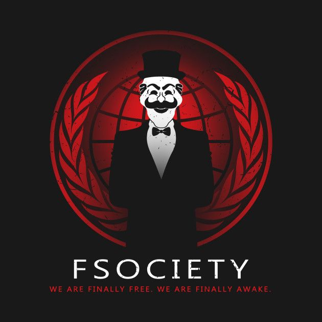

WE ARE FSOCIETY // by xx1lly

https://www.youtube.com/watch?v=594Ok9I4CK4
https://www.youtube.com/watch?v=594Ok9I4CK4
https://www.youtube.com/watch?v=594Ok9I4CK4

Fsociety — вымышленная хакерская группа из сериала Mr. Robot, вдохновлённая идеями киберанархизма и движениями вроде Anonymous; её цель — уничтожить долги и обнулить финансовую систему, взломав корпорацию E Corp; лидер — Mr. Robot (альтер эго Эллиота Олдерсона); эмблема — маска, напоминающая Гая Фокса; база — заброшенный дом на Кони-Айленде; символизирует протест против корпоративного контроля и социального неравенства

https://shameattacker.github.io/hellofriend/
либо же в actions - all workflows
